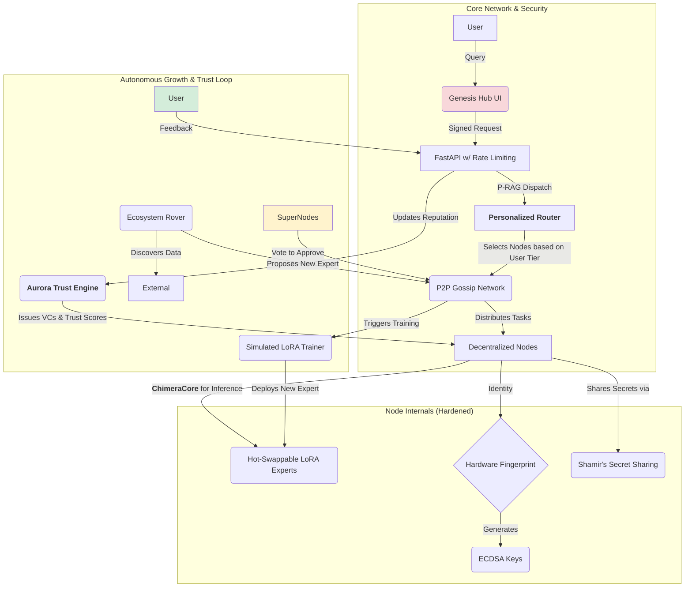

# 🌌 Genesis Core V8 - The "Bittensor-Lite" Ecosystem

**Genesis is a decentralized, self-sustaining AI network designed to be 100x lighter than Bittensor, with a built-in trust and certification layer.**

This is not just a Mixture-of-Experts; it's a **Symbiotic Network**. It combines a high-performance inference core with a decentralized P2P layer where nodes collaborate, vote on new AI models, and earn reputation through a trustless, verifiable system.

---

## ✨ Vision: Bittensor, but Lean and Verifiable

*   **Feather-Light Decentralization:** Where Bittensor requires massive compute and complex blockchain mechanics, Genesis uses a lightweight P2P gossip network and hardware-based identity to achieve consensus and security with minimal overhead.
*   **Built-in Trust:** The **Aurora Trust Engine** is a first-class citizen. User feedback and node contributions directly translate into verifiable credentials (VCs) and reputation scores, ensuring that only high-quality actors (both human and AI) can thrive.
*   **Autonomous Growth:** The network is designed to grow itself. An **Ecosystem Rover** agent discovers new knowledge, proposes new AI experts, and the network's trusted "Super Nodes" vote to approve and auto-deploy them.

---

## 🏛️ V8 Architecture: A Hardened, Decentralized Network

The V8 architecture is a closed-loop system hardened against attacks and designed for autonomous, decentralized operation.



---

## 🚀 Getting Started

```bash
# 1. Install all dependencies (Python packages)
make install

# 2. Run the one-time setup to create dummy data and configs
make setup

# 3. Run all CI self-tests to verify the system is working
make ci
```

## ⚙️ Running the Ecosystem

*   **Run the Genesis Hub UI (for users):**
    ```bash
    make demo
    ```
*   **Run the Live Network Dashboard (for operators):**
    ```bash
    make dashboard
    ```
*   **Run the API Server (in a separate terminal):**
    ```bash
    make run
    ```

---

##  license

This project operates under a dual-license model:
*   **Source-Available License:** Running a node for personal use or to participate in the network is permitted under the terms in `LICENSE`.
*   **Commercial License:** Enterprises wishing to use the Genesis Core for commercial purposes must obtain a separate license. See `LICENSE_COMMERCIAL.md` for details.
