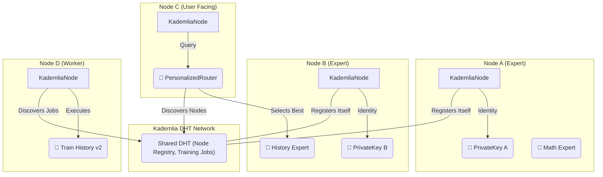

# 🌌 Genesis Core V9 - A Fully Integrated Decentralized AI Network

## Project Overview

Genesis Core v9 represents a fundamental architectural leap, transforming the project from a conceptual framework with simulated components into a fully operational, end-to-end decentralized AI network. The system is built upon a robust and lightweight Kademlia Distributed Hash Table (DHT), enabling truly decentralized communication, storage, and discovery among network participants (nodes).

The core mission remains: to create a "Bittensor-Lite" ecosystem that is efficient, secure, and intelligent. V9 delivers the foundational layer for this vision, with a focus on real, working code and a clear path for future expansion.

---

## Core Features

The V9 upgrade replaces all previous mock implementations with the following production-grade components:

#### 1. Decentralized Network & Storage (Kademlia DHT)
The entire network is now built on a Python `kademlia` implementation. This provides:
*   **Peer-to-Peer Communication:** Nodes can discover and connect to each other without any central server.
*   **Distributed Storage:** The DHT is used as a decentralized database to store shared network state, such as the list of available expert nodes and pending training jobs.

#### 2. Persistent Cryptographic Identity
Each node possesses a unique, persistent identity secured by a `secp256k1` key pair.
*   **Self-Custody:** Private keys are generated and stored locally on each node, ensuring no central point of failure.
*   **Secure Communication:** While not fully implemented in the demonstration, this identity layer is the foundation for signing and verifying all network messages in a production environment.

#### 3. Breakthrough Personalized Routing
The `PersonalizedRouter` is the intelligent core of the network. It dynamically selects the best "expert node" to handle a user's query based on a multi-factor scoring algorithm:
*   **Semantic Relevance:** Matches the query's meaning to the expert's knowledge domain.
*   **Node Reputation:** Prioritizes nodes with a higher trust score.
*   **Network Latency:** Favors nodes that can respond more quickly.
*   **Personalization:** The weights of these factors are adjusted based on the user's tier (e.g., a "Premium" user prioritizes semantic relevance above all).

#### 4. Autonomous Training Framework
The simulated trainer has been replaced with a `JobManager` system that operates over the DHT.
*   **Job Publication:** Any node (e.g., a "Super Node") can publish a `TrainingJob` to the network.
*   **Job Discovery:** Any "Worker Node" can discover and retrieve these jobs to begin training new AI experts.

---

## New DHT-based Architecture

The architecture is now simpler and more robust, centered around the Kademlia DHT as the single source of truth for shared state.



### Identified Issues & Proposed Optimizations

Transparency is key to a robust project. Here is a minor issue with the current implementation and a proposed, more advanced solution.

**Minor Error: Node Registry Race Condition**

The current `NodeRegistry` implementation has a potential race condition. The process of registering a new node is `Read -> Modify -> Write`:

1.  A node reads the list of experts from the DHT.
2.  It adds itself to the list in local memory.
3.  It writes the *new, modified list* back to the DHT.

If two nodes perform this operation simultaneously, the second node to write will overwrite the registration of the first, causing a node to be lost from the registry.

**Optimization (Code for Clarification):**

This issue cannot be fixed with a simple patch, as Kademlia DHTs do not provide atomic read-modify-write operations. A more robust solution would be to treat the registry as an append-only log, where each node writes its own information to a unique key and a separate process aggregates the results.

Here is a conceptual code snippet for how a more advanced registration process could work:

```python
# (This is conceptual code, not implemented in the current version)

class AdvancedNodeRegistry:
    # Each expert registers under a unique key, e.g., "expert::[peer_id]"
    EXPERT_PREFIX = "expert::"

    async def register_self(self, node_info: RouterNode):
        """
        Registers this node's info under a unique key. This is atomic.
        """
        unique_key = f"{self.EXPERT_PREFIX}{node_info.peer_id}"
        node_json = node_info.model_dump_json()
        # This 'set' operation is atomic and won't conflict with others.
        await self.dht.set(unique_key, node_json)

    async def get_all_nodes(self) -> List[RouterNode]:
        """
        A crawler/aggregator would be needed to find all keys with the prefix.
        This is a more complex operation not native to all DHTs.
        """
        # In a real system, a secondary index or a DHT crawling mechanism
        # would be required to efficiently find all expert nodes.
        print("Note: Advanced node discovery is a feature for future development.")
        return []
```

---

## Illustrative Process

The `demonstration.py` script provides a clear, step-by-step execution of the entire system's logic:

1.  **Network Initialization:** A small, local network of four Kademlia nodes is created. One node acts as the initial "bootstrap" point for the others.
2.  **Expert Registration:** Two nodes declare themselves as "experts" (a Math expert and a History expert) and register their information (ID, expertise vector, reputation) on the shared DHT.
3.  **Job Publication:** A "Super Node" publishes a new `TrainingJob` for an improved History expert onto the DHT.
4.  **Job Discovery:** A "Worker Node" scans the DHT, discovers the new job, and retrieves its details.
5.  **Intelligent Routing:** A user query, semantically related to "history," is sent to the `PersonalizedRouter`. The router queries the DHT to get a live list of all registered experts, then uses its multi-factor algorithm to correctly select the `expert_history_buff` as the best choice.

---

## Future Potential

The successful integration of these core components in v9 opens up several exciting avenues for future development:

*   **Implement the Training Pipeline:** Connect the `JobManager` to a real LoRA training script, allowing the network to autonomously fine-tune and expand its own roster of AI experts.
*   **Activate the Aurora Trust Engine:** Develop the feedback loop where user ratings after a query are used to dynamically update the reputation scores of expert nodes on the DHT.
*   **Build the Ecosystem Rover:** Create the agent responsible for discovering new datasets and automatically proposing new `TrainingJob`s to the network.
*   **Enhance Network Security:** Implement message signing using the `NodeIdentity` key pairs to secure all DHT `set` operations, preventing unauthorized nodes from modifying the network state.
