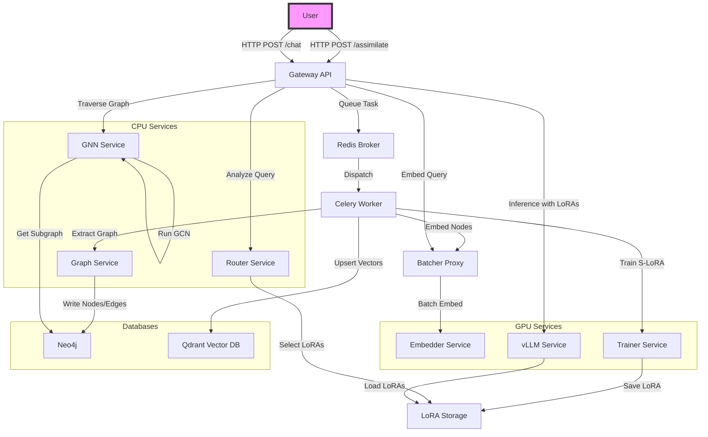

# TWP-Omega-VInfinity

This project is a perpetual AI OS that uses a microservices architecture to assimilate and chat with data.

## Architecture Diagram

## How to Run

1.  Clone the repository.
2.  Make sure you have Docker and Docker Compose installed.
3.  Run `docker-compose up -d`.

The API will be available at `http://localhost:8000`.
