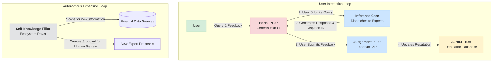
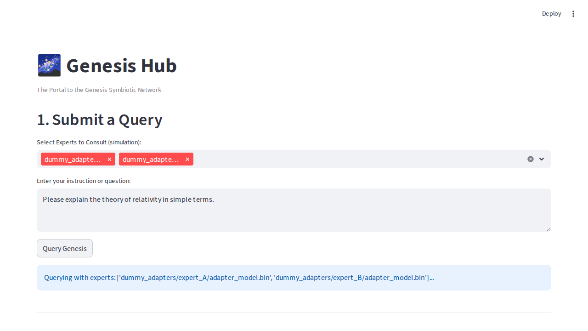

# 🌌 Genesis Core V7 - The Symbiotic Network

**Genesis is a self-sustaining, decentralized AI ecosystem designed to autonomously grow, learn, and improve through user interaction and self-discovery.**

This project has evolved beyond a simple "Mixture of Experts" into a "Symbiotic Network." It features a revolutionary architecture where user feedback directly shapes the system's knowledge and a proactive agent seeks out new information to expand its own capabilities.

---

## ✨ Core Features

*   **🧠 The Three Pillars of V7:**
    1.  **Portal Pillar (Genesis Hub):** A user-friendly Streamlit interface for anyone to interact with the AI, submit queries, and provide feedback.
    2.  **Judgement Pillar (Feedback Loop):** A robust API backend that processes user feedback to dynamically update the reputation and trustworthiness of its AI experts using an Exponential Moving Average (EMA).
    3.  **Self-Knowledge Pillar (Ecosystem Rover):** An autonomous agent that scans for new data sources and proactively proposes the creation of new specialized experts, enabling the system to grow its own knowledge base.
*   **🚀 High-Performance Inference:** Powered by the `ChimeraCore`, which uses `llama-cpp` for efficient GGUF model loading and dynamic LoRA adapter hot-swapping.
*   **信頼 Aurora Trust System:** A sophisticated reputation engine that manages expert scores and forms the foundation of the system's learning and self-regulation.
*   **🔧 Simplified Onboarding:** Get up and running in minutes with a simple setup script and a `Makefile` for common tasks.

---

## 🏛️ V7 Architecture: The Symbiotic Network

The V7 architecture is designed as a closed-loop system where user interaction and autonomous discovery work together to create an ever-evolving intelligence.



---

## 🖥️ The Genesis Hub in Action

The Portal Pillar provides a clean and intuitive interface for users to leverage the power of the Genesis network.



---

## 🚀 Getting Started

Setting up the Genesis Core V7 environment is straightforward.

### 1. Prerequisites

*   Python 3.10+
*   `pip` and `venv`

### 2. Installation & Setup

A simple `Makefile` command handles everything from dependency installation to setting up the dummy environment needed for testing.

```bash
# 1. Clone the repository
git clone <repository_url>
cd <repository_directory>

# 2. Run the all-in-one setup command
make setup
```

This command will:
*   Install all required Python packages from `requirements.txt`.
*   Run the `setup.sh` script to create the necessary dummy models, adapters, and configuration files for the system to run.

---

## ⚙️ How to Use Genesis

### Running the System

The core of the system is the FastAPI backend and the Streamlit frontend.

**1. Start the Backend API Server:**
The API server handles feedback and other core functions.
```bash
# To be implemented - running the FastAPI app
# For now, the API is tested via the self-test script.
```
*Note: A future update will include a `make run-api` command.*

**2. Launch the Genesis Hub UI:**
Start the Streamlit application to interact with the system.

```bash
make demo
```
This will launch the web interface, typically at `http://localhost:8501`.

### Running the Self-Test

To verify that all components of the V7 architecture are working correctly, run the full integration self-test.

```bash
make ci
```
This will execute the script in `ci/selftest.py`, which simulates a full user query and feedback loop, ensuring the reputation engine is functioning as expected.

---

## 📁 Project Structure

The repository is organized into the following key directories:

```
.
├── agents/             # Autonomous agents (e.g., EcosystemRover)
├── api/                # FastAPI application for the backend
├── aurora_trust/       # The core reputation and VC engine
├── ci/                 # Continuous integration and self-test scripts
├── docs/               # Documentation and images
├── frontend/           # The Streamlit UI application
├── inference/          # The ChimeraCore for model inference
├── tools/              # Helper scripts (e.g., expert builder)
├── Makefile            # Convenience commands for setup, testing, etc.
└── setup.sh            # Script to initialize the dummy environment
```
